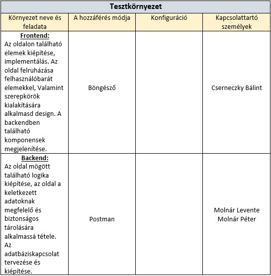

# Tesztelési terv
A csapatunk két nagyobb csoportból áll, <strong>frontend</strong> és <strong>backend</strong>. A frontend <strong>HTML</strong>, <strong>CSS</strong>
és <strong>Bootstrap</strong>-el míg a backend <strong>MySQL</strong>, és <strong>PHP</strong>-vel, dolgozik. Frontenden <strong>LandingPage</strong>,
<strong>AdminPage</strong>, <strong>CarListPage</strong>, <strong>CarAddPage</strong>, <strong>LoginPage</strong> és <strong>LoginForm</strong> Backenden
pedig a nagyobb komponensek az <strong>AutoRegister</strong>, <strong>Login</strong>, <strong>ConnectToServer</strong>, <strong>Modells</strong>,
<strong>Authentication</strong>. A tesztelést frontend részen tesztelők végzik akik végig járják az oldalakat, funkciókat és ellenőrzik, hogy minden az
annak megfelelő módon működik illetve néz ki. Backenden pedig egy algoritmussal terhelni az adatbázist illetve a szervert valamint tesztelők közreműködésével a
különböző funkciókat/komponenseket. A backend teszteléséhez használatos program első sorban az <strong>Insomnia</strong>. 

## Bevezetés
Tesztelési tervünk célja a tesztelés felgyorsítása, gördülékenyebbé tevése. Biztosítani, hogy minden lényeges valamint elengedhetetlen funkció, oldal és interaktív felület tesztelésre kerüljön.

## Tesztadatok
•	A teszt végrehajtásához szükséges rekordok (tesztadatok) száma: 59 
•	A tesztadatok elkészítéséért és feltöltéséért felelős személy: Molnár Péter

## Fejlesztői teszt
A fejlesztés vége felé közeledve a fejlesztői csapat tagjai a lehető legtöbb módon átvizsgálja az oldalt, teszt alá vetik az oldal által nyújtott lehetőségeket, funkciókat.

## Tesztelendő elvárások

## Tesztelt elvárások

## Elfogadási kritériumok
A teszt sikerességének kritériumai: 
•	Technikai, a teszt forgatókönyvben leírtak szerint. 
•	A projekt menedzser jóváhagyása.

## Leszállítandó dokumentumok

